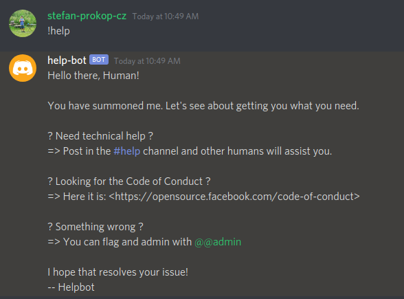

# Discord Help Bot

- Simple [Discord](https://discord.com/) bot that will send a HELP message (like `--help` command) to your channel after you send a `!help` message.

## Prerequisites
### Discord Server
- Open the Discord app
- Click the plus icon `Add a Server`
- Fill all the necessary information
- Click `Create`

### Create Channel
- Click the plus icon on the left side next to the `TEXT CHANNELS`
- Create a channel
- Get the channel ID
    - Preferences > Appearance > Developer mode
    - Right click on your channel > Copy ID

### Add role
- Click on the server dropdown menu
- Select `Server settings`
- Go to `Roles`
- Click the plus next to `Roles`
- Create a new role
- Copy role ID
  - Right click on the role > Copy ID
- Set the <role> to yourself
  - Right sidebar > Roles > check the <role>

### Create App
- Go to https://discord.com/developers/applications
- Login and click `New application` in the top right
- Enter a name

### Create Bot
- On the left sidebar of your application page click `Bot`
- Click `Add bot`
- Fill all the necessary information
- Click `OAuth2` on the left sidebar
- Select the `bot` scope, `Send messages` and `Read message history` permissions
- Copy the generated OAuth URL and open it in new tab
- Register app to your server
- On the `Bot` page copy the token

## Installation & Run
- Clone this repository
- You can modify the `HELP_MESSAGE` text on the line 9
- Replace the channel_id (line 15) with your channel ID
- Replace the role_id (line 21) with your role ID
- Run `cargo build`
- Run `DISCORD_TOKEN=<token> ./target/debug/discord-help-bot`
